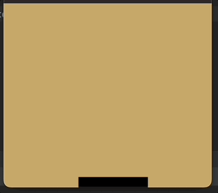
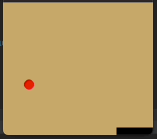
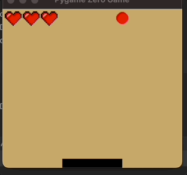
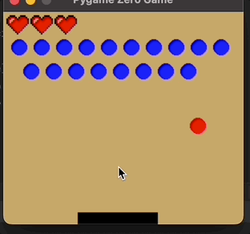

###### Практична робота №8
## Різдвяний арканоїд

### Мета роботи:
На практиці спробувати написати першу не консольну програму на Python, розібратися з бібліотекою PyGame Zero, виориставши наявні знання з программування та математики створити гру.

## Загальний опис
Арканоід - дуже відома та стара гра, вперше створена ще для аркадних автоматів у 1986 році. Детальніше прочитати про історію гри можна на [вікі](https://en.wikipedia.org/wiki/Arkanoid), зіграти в оригінальну версію (обережно, дуже складно!) - [тут](https://www.free80sarcade.com/arkanoid.php). Ми з вами створимо у якості вправи просту версію цієї гри

## Завдання

#### Підготовка до виконання

Pygame Zero не відноситься до стандартних бібліотек, що йдуть разом з інтерпретатором Python, тому вам потрібно встановити його окремо. Для цього відкрийте термінал (системний або вбудований в PyCharm через `View > Tool Windows > Terminal`)


#### Основи

Розпочніть створення програми із стандартної заготовки, з якої ми починаємо створення додатків на Pygame Zrto. Пригадайте, які функції виконує цей код і для чого потрібні методи `draw()` та `update(dt)`:

```Python
import pgzrun

WIDTH = 600
HEIGHT = 800


def draw():
    pass


def update(dt):
    pass


pgzrun.go()
```

Додайте у проект рухому платформу (назвіть цей класс `Paddle`) знизу екрану, яка рухається ліворуч та праворуч за мишкою. Для цього вам може знадобитись метод `on_mouse_move(pos)`, який працює по аналогії з `on_mouse_down(pos)` але викликається зажди коли курсор рухається у грі.


Далі, додайте мʼяч, який рухається по прямій та відбивається від стінок ігрового поля. При відбиванні кут під яким мʼяч відлітає від стінки має дорівнювати куту


Тепер час додати життя - кожного разу, коли мʼяч торкається нижньої поверхні ігрового поля поза платформою, позиція мʼяча має скидатись, а гравець втрачати одне життя. Коли життів не лишилося, гра програна (виведіть на екран великими літерами `GAME OVER`)



Тепер найцікавіше - перешкоди. В оригінальній грі ці перешкоди прямокутні, але ми зробимо круглі, оскільки знаходження перетину двох кіл простіше реалізувати. Для початку, додайте в гру нову сутність `Obstacle`, що виглядає як коло та розмістіть набір цех перешкод на ігровому полі. Можете самостійно обрати їх кількість та позиції

На першому етапі, зробіть так що якщо мʼяч налітає на перешкоду, то він її знищує і при цьому не змінює траекторії руху. Це дозволить вам зробити повноцінну гру, в якій можна виграти або програти - необхідно просто рахувати кількість перешкод на полі, і якщо гравець знищив усі, виводити надпис `YOU WON!`


І найцікавіше наостанок - якщо мʼяч врізається в перешкоду, то він відлітає по напрямку від центру перешкоди. З цим фукнціоналом гра повністю готова! Лишилось тільки підібрати такі параметри швидкості мʼяча, щоб від гри лишались приємні відчуття.



> Таким чином, наприкінці виконання у вас в проекті мають бути класи `Paddle`, `Ball` та `Obstacle`. Ви можете знайти велику кількість туторіалів про арканоїди на PyGame Zero в інтернеті та можете користуватися ними з довідковою метою (а можете ще приходити з питаннями на офісні години), але структура роботи яку ви здаєте має бути у відповідності саме до нашого завдання. Копіювання коду з туторіалів не допускається

#### Додаткові завдання

В цій роботі ви можете заробити додаткові бали:
1.**Міцні платформи**. Додайте кольорову дифернціацію перешкод за міцністю - певного типу перешкоди мають один колір і знищуються від одного попадання, іншого кольору - від двох і так далі. _+0.5 бали_
2.**Додаткові життя**. З певною періодичністю зверху екрану починає повільно спускатися не реагуючи на перешкоди символ сердця (намалюйте самі або візьміть з інтернету зображення). Якщо гравець "ловить" його платформою, то отримує додаткове життя. _+1 бал_
3.**Збільшення платформи**. Додайте ще один вид бонусів що можна зловити платформою - на цей раз бонус має на певну кількість секунд збільшити ширину платформи у 1.5 рази. _+1 бал_
4.**Прямокутні платформи**. Це більш складне завдання - подумайте, як можна реалізувати у грі прямокутні перешкоди, враховуючи що мʼяч може влучити у перешкоду як у її грань, так і в кут. _+2 бали_

## Корисні посилання
- офіційна документація по [PyGame Zero](https://pygame-zero.readthedocs.io/en/stable/introduction.html)

## Контрольні питання
1. Що таке клас та екземпляр класу?
2. Що роблять методи `__init__`  та `__str __`?
3. Що означає параметр dt у функції `update`?
4. Що означає параметр `self`?

## Оцінювання
Максимальний бал - 6 (+4.5 додаткових):
- 1 бал - рухома платформа, мʼяч що відскакує від стін та платформи;
- 1.5 бали - відскакування від круглих перешкод;
- 1.5 бали - підрахунок перешкод, можливість виграти та програти;
- 1 бал - відповіді на питання при здачі;
- 1 бал - виконання практичного завдання при здачі.
- до 4.5 додаткових балів за додатковий функціонал у грі.

